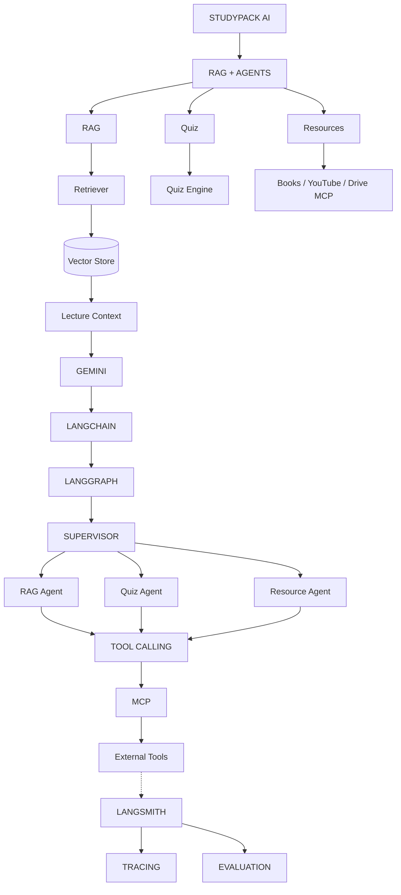

# StudyPack Application Workflow

This document describes the primary user journeys and data flows within the StudyPack application.

## User Workflow Diagram

## Explanation

The user experience in StudyPack is designed to take raw data and turn it into actionable learning experiences.

### 1. Onboarding & Dashboard
A user logs in securely using Clerk authentication. They arrive at the Dashboard, which fetches their existing Study Packs and summarizes recent quiz performance and analytics.

### 2. Creation Phase (Data Ingestion)
To create a new Study Pack, the user navigates to the Create workflow.
- **Data Source**: The user can upload local documents (PDFs), type text, or connect external integrations via the MCP Client (Google Drive, GitHub).
- **Processing**: The backend `extract` endpoint parses the incoming data. 
- **Generation**: The AI Pipeline (powered by LangChain) takes the extracted text, chunks it, and prompts the LLM to generate comprehensive study notes, flashcards, and a base set of quiz questions.

### 3. Study Phase (Active Learning)
- **Review**: Users can read through the generated markdown notes. They can also hit the `/export` endpoint to download a PDF version via ReportLab.
- **Quiz**: Users engage with the Progressive Quiz engine. As they answer questions, the backend tracks correctness and adjusts the difficulty dynamically.

### 4. AI Tutor Phase (Interactive Help)
If a user struggles with a concept, they can switch to the AI Tutor tab.
- **RAG Architecture**: The chat interface sends queries to the backend, which uses Retrieval-Augmented Generation to search the user's specific Study Pack embeddings and provide highly contextual, accurate explanations.

### 5. Review Phase (Retention)
- **Analytics Engine**: Processes quiz results to show mastery over different topics.
- **Revision Engine**: Implements a spaced repetition logic to suggest which flashcards or topics the user needs to revisit to optimize memory retention.
